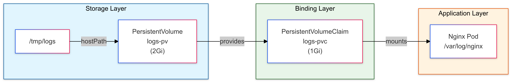

# 🌉 Kubernetes PersistentVolume Storage Management

[](https://github.com/TheToriqul/k8s-pv-setup)
[](https://github.com/TheToriqul/k8s-pv-setup/stargazers)


## 📋 Project Overview

This project implements Kubernetes storage management using PersistentVolumes (PV) and PersistentVolumeClaims (PVC). Through this implementation, I've created a robust storage solution that demonstrates the seamless integration of persistent storage in Kubernetes environments.

## 🎯 Key Objectives

- Create and manage PersistentVolumes in Kubernetes
- Configure PersistentVolumeClaims with specific requirements
- Set up proper storage access modes and capacities
- Deploy containerized applications with persistent storage
- Implement production-ready storage solutions

## 🏗️ Project Architecture

<figure>
  <p align="center">
    
    <p align="center">Kubernetes PV/PVC Architecture Overview</p>
  </p>
</figure>

## 💻 Technical Stack

- Frontend: Not applicable
- Backend: Nginx web server
- Database: Not applicable
- DevOps: 
  - Kubernetes for orchestration
  - Docker for containerization
  - Ubuntu 20.04 for host OS
  - VS Code for development

## 🚀 Getting Started

<details>
<summary>🐳 Prerequisites</summary>

- Kubernetes cluster (v1.19+)
- kubectl CLI tool
- Docker runtime
- Basic Kubernetes knowledge

</details>

<details>
<summary>⚙️ Installation</summary>

1. Clone the repository:
   ```bash
   git clone https://github.com/TheToriqul/k8s-pv-setup.git
   ```
2. Navigate to the project directory:
   ```bash
   cd k8s-pv-setup
   ```
3. Follow setup instructions in reference-commands.md

</details>

<details>
<summary>🎮 Usage</summary>

1. Create PersistentVolume:
   ```bash
   kubectl apply -f logs-pv.yaml
   ```
2. Create PersistentVolumeClaim:
   ```bash
   kubectl apply -f logs-pvc.yaml
   ```
3. Deploy Nginx pod:
   ```bash
   kubectl apply -f nginx-pod.yaml
   ```

For detailed commands and explanations, refer to the [reference-commands.md](reference-commands.md) file.

</details>

## 💡 Key Learnings

### Technical Mastery:

1. Kubernetes storage architecture implementation
2. Volume lifecycle management
3. Storage provisioning and binding
4. Access mode configuration
5. Container volume mounting

### Professional Development:

1. Infrastructure as Code practices
2. System design principles
3. Kubernetes resource management
4. Technical documentation
5. Problem-solving methodologies

### 🔄 Future Enhancements

<details>
<summary>View Planned Improvements</summary>

1. Dynamic volume provisioning
2. Storage class implementation
3. Backup and restore functionality
4. Monitoring integration
5. Multi-node storage support
6. Storage encryption
</details>

## 🙌 Contribution

Contributions are welcome! Feel free to [open an issue](https://github.com/TheToriqul/k8s-pv-setup/issues) or submit a [pull request](https://github.com/TheToriqul/k8s-pv-setup/pulls).

## 📧 Connect with Me

- 📧 Email: toriqul.int@gmail.com
- 📱 Phone: +65 8936 7705, +8801765 939006
- 🌐 LinkedIn: [@TheToriqul](https://www.linkedin.com/in/thetoriqul/)
- 🐙 GitHub: [@TheToriqul](https://github.com/TheToriqul)
- 🌍 Portfolio: [TheToriqul.com](https://thetoriqul.com)

## 👏 Acknowledgments

- [Poridhi for providing comprehensive labs and inspiring this project](https://devops.poridhi.io/)
- The Kubernetes community for excellent documentation
- The CNCF for promoting cloud-native technologies

---

Thank you for visiting this repository and joining me on this learning journey! 🚀